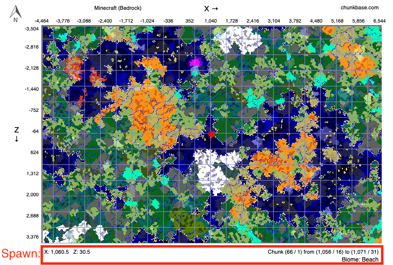

---
# Feel free to add content and custom Front Matter to this file.
# To modify the layout, see https://jekyllrb.com/docs/themes/#overriding-theme-defaults
title: map
layout: default
---

_Click [here](images/biome_key.png) to view the biome color key._

The following user-contributed points of interest are sourced from [overworld.csv](overworld.csv):

<table>

  <tr>
      <td> <strong>
      <a href="{{ row.href }}">
      {{ row.Description }}
      </a>
      </strong> </td> <td> {{ row.x }} </td> <td> {{ row.z }} </td>
  </tr>

</table>